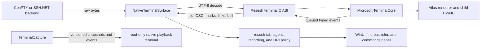

# Native Microsoft Terminal Parity Plan

Status: implementation in progress — Phases 0–2 complete

Related work:

- [FUTURE.md](FUTURE.md), item 2: native terminal surface through Microsoft Terminal
- [ROADMAP.md](ROADMAP.md): current xterm.js terminal capabilities
- Upstream source: [microsoft/terminal](https://github.com/microsoft/terminal)

## Goal

Replace the live WebView2 and xterm.js terminal surface with a pinned, app-local build of Microsoft Terminal while preserving all current resesh behavior:

- local ConPTY and SSH.NET backends
- bounded rewind and recording
- title, working-directory, prompt, context, and agent events
- search and links
- persistent highlight rules
- command marks, overview ruler, bookmarks, and commands panel
- configurable scrollback
- copy and paste settings
- accessibility, input, resize, theme, split, and teardown behavior

The final cutover removes the WebView2 live and playback paths. It does not keep two permanent terminal implementations.

## Non-goals

- Replace `LocalTerminalSession`, `SshTerminalSession`, SSH authentication, SFTP, SSHFS, tmux, or recording formats.
- Use `ssh.exe` as the SSH backend.
- Import Microsoft Terminal's WinUI 2 `TermControl` into the WinUI 3 visual tree.
- Expose Microsoft Terminal C++ or WinRT types to application code.
- Serialize raw C++ object memory as a rewind format.
- Let native code open links, map agents, or approve untrusted terminal requests.

## Decisions

1. Keep `HwndTerminal` as the rendering host. Extend it through a resesh-owned, versioned C ABI.
2. Maintain a separate fork of `microsoft/terminal`. Pin both the upstream base commit and the fork commit.
3. Keep transport and product policy in resesh. Native code owns terminal parsing, buffer state, hit testing, search spans, and rendering.
4. Put find, ruler, and commands surfaces beside the child HWND. Do not draw XAML above it.
5. Queue native events while TerminalCore holds its lock. Invoke managed callbacks only after the lock is released.
6. Use caller-owned buffers or callbacks with explicit lengths. Do not return borrowed strings with unclear lifetime.
7. Ship x64 and ARM64 application-local binaries. Never load the DLL from another installed package.
8. Make native mode opt-in until every cutover gate passes. Then remove the WebView2 implementation and feature flag in one clean cutover.

## Target architecture



## Repository and artifact model

Use a separate fork repository rather than a large nested submodule in the application repository.

Add these application-repository assets when implementation starts:

```text
eng/native-terminal.json                 pinned upstream and fork commits, ABI version, artifact hashes
eng/build-native-terminal.ps1            deterministic fork checkout and build entry point
src/Terminal/Native/ReseshTerminalAbi.cs managed ABI declarations
src/Terminal/Native/NativeTerminalApi.cs dynamic loading and version validation
src/Terminal/Native/NativeTerminalSurface.cs HWND host
src/Terminal/Native/NativeTerminalEvents.cs typed event conversion
src/Terminal/Native/NativeTerminalSnapshot.cs snapshot envelope validation
```

The fork repository owns:

```text
src/cascadia/TerminalControl/ReseshTerminalAbi.h
src/cascadia/TerminalControl/ReseshTerminalAbi.cpp
TerminalCore, parser, buffer, and renderer patches
native ABI and TerminalCore unit tests
```

`eng/native-terminal.json` must record:

- upstream base commit
- fork commit
- ABI major and minor versions
- supported architectures
- DLL and symbol-file SHA-256 hashes
- Microsoft Terminal license revision
- build configuration and toolchain version

## ABI rules

The first fork change creates one stable resesh ABI. Do not extend the existing unversioned exports ad hoc.

Required foundation exports:

```text
ReseshTerminalGetAbiVersion
ReseshTerminalGetBuildId
ReseshTerminalCreate
ReseshTerminalDestroy
ReseshTerminalRegisterEventCallback
ReseshTerminalSendOutput
ReseshTerminalSendKeyEvent
ReseshTerminalSendCharEvent
ReseshTerminalSetFocused
ReseshTerminalResizePixels
ReseshTerminalSetOptions
```

Every public structure must contain:

- `structSize`
- `abiMajor`
- `abiMinor`
- fixed-width integer fields
- pointer and length pairs for strings and arrays
- explicit ownership and callback-lifetime rules

ABI invariants:

- Major-version mismatch fails before terminal creation.
- A newer minor version can append fields after `structSize`.
- All text is UTF-16 at the ABI boundary unless a field explicitly says UTF-8.
- Callback data is valid only during the callback. Managed code copies it before returning.
- A callback cannot call back into the same terminal.
- Native code caps event payload sizes before allocation.
- Managed code validates counts, lengths, enum values, and snapshot versions.
- Destroy waits for native event dispatch to finish and prevents later callbacks.

## Phase 0 — Baseline, safety, and acceptance budgets

### Work

1. Capture the current WebView2 and native MVP behavior for the same deterministic VT fixtures.
2. Record startup time, private memory, sustained output throughput, input-to-paint latency, resize latency, and snapshot latency.
3. Define approved regression budgets from those measurements before implementation continues.
4. Stop native instant-rewind capture from growing without a keyframe. Until Phase 6 lands, either disable native rewind or enforce a hard raw-event limit with a clear unavailable state.
5. Record current visual and behavioral fixtures for:
   - normal and alternate buffers
   - Unicode and wide glyphs
   - colors and line rendition
   - OSC 8 links
   - OSC 7, OSC 133, OSC 3008, OSC 7377, OSC 9, and OSC 777
   - search, highlights, command marks, and bookmarks
   - copy-on-select and right-click paste

### Deliverables

- A checked-in capability matrix with WebView2 and native columns.
- A deterministic VT fixture set shared by C++, C#, and UI tests.
- Recorded performance budgets.
- A safe native rewind state with bounded memory.

### Gate

No native run can exceed the configured capture byte limit when no snapshot exists.

## Phase 1 — Reproducible fork, build, and ABI foundation

### Fork work

1. Create the Microsoft Terminal fork from one released upstream commit, not moving `main`.
2. Add `ReseshTerminalAbi.h/.cpp` beside `HwndTerminal`.
3. Wrap existing creation, input, output, focus, resize, theme, selection, and scroll operations.
4. Add an internal event queue. TerminalCore callbacks append copied event payloads while locked. `ReseshTerminalSendOutput` drains the queue after releasing the TerminalCore write lock.
5. Export build ID and ABI version.
6. Build Release x64 and ARM64 binaries and matching symbols.
7. Keep Microsoft copyright and MIT license notices in source and packages.

### Application work

1. Replace delegate discovery for individual upstream names with the resesh ABI table.
2. Reject incompatible ABI versions and architecture mismatches with an inline error.
3. Resolve only an explicit configured path or the application-local architecture path.
4. Verify artifact hashes against `eng/native-terminal.json` for packaged builds.
5. Keep WebView2 as the default during the implementation period.

### Tests

- Missing DLL, wrong architecture, wrong ABI major, truncated ABI structure, and missing required export.
- Create and destroy 100 terminals without a callback after destroy.
- Output during close and backend output racing with disposal.
- Split reparenting, inactive-tab hiding, DPI change, and repeated resize.

### Gate

Both architectures build reproducibly. The application starts, opens a local tab and an SSH.NET tab, and tears them down with no leaked terminal HWND or callback.

## Phase 2 — Settings, input, scrollback creation, and clipboard parity

### Native creation options

Add a versioned creation structure with:

- initial columns and rows
- history size
- font face, size, weight, and built-in glyph options
- color table, foreground, background, selection, and cursor colors
- cursor shape
- URL detection
- copy-on-select
- right-click paste
- copy formatting flags
- paste filtering flags
- snap-on-input
- word delimiters
- allowed OSC clipboard and notification settings

Replace the hard-coded `Terminal::Create({80, 25}, 9001, renderer)` call with validated creation options.

### Clipboard work

Port the proven `ControlCore` behavior into the HWND host:

- explicit copy and paste ABI functions
- plain, HTML, and RTF copy payloads
- copy-on-select without clearing selection
- Ctrl+Shift+C and Ctrl+Shift+V
- optional right-click paste
- CR/LF and control-code filtering
- bracketed paste when TerminalCore reports that mode
- clear selection and return to the live viewport after paste
- no copy-on-select when search changes selection

Application code remains responsible for Clipboard access when policy or format handling requires it. Native callbacks carry copied text and formats; they do not retain clipboard handles across calls.

### Tests

- Selection copy for wrapped, wide, combining, HTML, and RTF text.
- Copy-on-select enabled and disabled.
- Search selection does not overwrite the clipboard.
- Right-click paste enabled and disabled.
- Bracketed and normal paste.
- Control characters, CR/LF normalization, large paste, and read-only playback.
- Initial history sizes of 0, small, default, large, and maximum accepted values.

### Gate

The native surface passes the current resesh clipboard-setting matrix and opens new tabs with the configured history size.

## Phase 3 — Typed terminal events and custom OSC observation

### Standard events

Wire existing upstream state to queued typed events:

- title changed
- working directory changed
- bell
- buffer or viewport changed
- alternate-buffer entered or exited
- shell mark changed
- terminal mode changes needed by clipboard and playback

For working directory, add a direct TerminalCore callback. Do not compare only the value before and after a large output batch because that can miss intermediate changes.

### Generic OSC observer

Add a non-consuming observer at the start of `OutputStateMachineEngine::ActionOscDispatch`.

The observer reports:

- numeric OSC code
- exact payload with an explicit length
- monotonically increasing event sequence number

Normal upstream dispatch continues after observation. This is required because OSC 9 is both a resesh agent signal and an upstream-recognized action.

Observe and forward at least:

- OSC 0 and 2 title events
- OSC 7 working directory
- OSC 133 shell integration
- OSC 3008 resesh context
- OSC 7377, 9, and 777 agent evidence

### Application policy

Keep these behaviors in C#:

- payload length and syntax validation
- `Osc7WorkingDirectoryTracker`
- `Osc3008Context` mapping
- agent identity and attention mapping
- title and command precedence rules
- SFTP path selection
- alerts and notifications

### Tests

- OSC terminated by BEL and ST.
- OSC split at every byte boundary across backend reads.
- Multiple OSC events in one output write.
- UTF-8 split inside a payload.
- Malformed, oversized, and unterminated payloads.
- OSC 9 is observed and still processed by upstream.
- Event ordering against text, title, command, and working-directory changes.
- Managed callback attempts no terminal reentry while the native lock is held.

### Gate

The native event stream produces the same validated resesh state transitions as the current xterm.js event stream for all fixtures.

## Phase 4 — Search and links

### Search ABI

Port `ControlCore::Search` and its `Search` member into the HWND host.

Exports:

```text
ReseshTerminalSearch
ReseshTerminalClearSearch
ReseshTerminalGetSearchState
```

The request includes:

- query text
- forward or backward direction
- case sensitivity
- regular-expression mode
- incremental or explicit navigation
- scroll-into-view flag

The response includes:

- total matches
- current match
- invalidated flag
- invalid-regex flag

Use TerminalCore's search-highlight spans and renderer invalidation. Do not scan the buffer a second time in C#.

### Find UI

1. Add a WinUI find row above the terminal.
2. Opening the row reduces the HWND height; it never overlays the HWND.
3. Route Ctrl+Shift+F, Enter, Shift+Enter, Escape, case, and regex controls.
4. Keep keyboard focus in the find field while native search changes the terminal selection.
5. Return focus to the terminal on close.

### Links

1. Apply the upstream `DetectURLs` setting at creation.
2. Update the upstream pattern tree after output.
3. Hit-test explicit OSC 8 links and detected URLs from child-window mouse coordinates.
4. Add hover state and a hand pointer.
5. Raise an open-link event with the URI and source type.
6. Let resesh validate and open the URI. Native code must not call `ShellExecute`.

### Tests

- Plain, case-sensitive, Unicode, wide-glyph, wrapped, and regex search.
- Invalid regex during incremental typing.
- More than 1,000 matches without an incorrect count contract.
- Search after output, resize, reflow, buffer rotation, and alternate-screen exit.
- OSC 8 links, detected URLs, overlapping punctuation, wrapped URLs, and malicious schemes.
- Shift selection and VT mouse mode still take precedence where required.

### Gate

Search and link behavior matches the current product, including keyboard navigation, result rendering, URI policy, and focus restoration.

## Phase 5 — Prompt discovery, command marks, ruler, bookmarks, and commands panel

### Exact shell marks

Use upstream OSC 133, OSC 1337 `SetMark`, and supported shell-integration mark data. Export stable mark records containing:

- generation-scoped mark ID
- prompt, command, and output extents
- command text
- exit code
- category and optional color
- start and end rows

Exports:

```text
ReseshTerminalGetMarks
ReseshTerminalGetMarkText
ReseshTerminalGetMarkOutput
ReseshTerminalScrollToMark
ReseshTerminalAddBookmark
ReseshTerminalRemoveBookmark
ReseshTerminalClearBookmarks
```

Never expose pointers to `MarkExtents` or other C++ structures.

### Enter-gated prompt discovery

Microsoft Terminal does not implement the current resesh heuristic. Keep it in resesh:

1. Before sending Enter, query the cursor logical line and cursor position.
2. Include wrapped predecessor rows.
3. Record the event sequence and title epoch.
4. Evaluate after remote echo settles.
5. Apply the existing platform prompt rules.
6. Create a neutral discovered mark through the ABI.
7. Disable discovery after the first exact OSC 133 sequence.
8. Attach validated OSC 3008 command results without replacing discovery.

Add exports for cursor logical-line query and creating an application mark.

### Ruler

1. Implement the ruler as a docked WinUI column beside the HWND.
2. Read compact mark rows, search rows, highlight rows, bookmarks, viewport, and buffer height.
3. Preserve current lane precedence and exit-status colors.
4. Support click-to-scroll, hover details, next/previous command, and bookmark toggle.
5. Throttle high-frequency scroll updates, but never reorder mark generations.

### Commands panel

1. Implement the panel as a docked WinUI side pane.
2. Query command records only when the panel opens or a mark generation changes.
3. Support jump and copy-output.
4. Extract output natively from mark extents so wrapped rows and buffer rotation use one coordinate model.
5. Opening the panel resizes the terminal instead of covering it.

### Tests

- OSC 133 A/B/C/D, missing C, missing D, malformed exit code, and repeated prompts.
- Wrapped and multiline commands.
- Empty Enter, prompt-looking output, and command echo races.
- OSC 3008 association.
- tmux reattach with no historical marks.
- Buffer rotation and resize reflow preserve mark identity or issue a new generation.
- Ruler click, keyboard jump, bookmark, copy-output, split groups, and inactive tabs.

### Gate

The native ruler and commands panel match all current resesh command discovery, navigation, bookmark, and copy-output contracts.

## Phase 6 — Bounded ANSI keyframes and native-backed rewind

This phase restores bounded rewind before the full snapshot format is complete.

### Native snapshot export

Refactor `TextBuffer::SerializeTo(HANDLE)` so the serializer can write to an in-memory sink. Add an ABI snapshot that contains:

- schema and upstream build IDs
- active-buffer ANSI reconstruction stream
- columns and rows
- cursor position and visibility
- viewport and scroll offset
- active main or alternate buffer identity
- title and working directory
- capture event sequence and timestamp

Capture every 10 seconds or 1 MiB of backend output, matching the current product policy. Copy the necessary state under the read lock, then encode outside the lock.

### Rewind path

1. Continue to use the existing `TerminalCapture` event ordering and asciicast recording format.
2. Store the native ANSI snapshot as a versioned keyframe payload.
3. Build a read-only playback terminal from the snapshot and later output and resize events.
4. Ensure rapid seeking uses generation cancellation and cannot interleave two restores.
5. Enforce the 30-minute and 32 MiB bounds now that keyframes exist.

This phase is an interim format. Phase 8 replaces it with exact native snapshots and removes the ANSI compatibility path.

### Tests

- Seek immediately before and after every keyframe.
- Split escape and UTF-8 sequences around keyframe boundaries.
- Main and alternate buffers.
- Resize before and after keyframe.
- Hyperlinks, attributes, line rendition, wide glyphs, and cursor position.
- Repeated rapid scrubbing.
- Hard memory and age bounds.

### Gate

Native mode has bounded instant rewind and `.cast` playback with no full replay from session start during ordinary seeks.

## Phase 7 — Persistent multi-rule highlights

This phase is a TerminalCore and Atlas renderer extension.

### Data model

Add a decoration layer separate from stored cell attributes:

```text
HighlightRule: id, pattern, regex flag, case flag, foreground, background, priority
HighlightSpan: rule id, start cell, end cell, buffer generation
```

Rules compile once. Invalid rules report a typed error and do not change active rules.

### Incremental indexing

1. Scan changed logical lines after output.
2. Include enough preceding content for wrapped lines and boundary-crossing regular expressions.
3. Rebase or rescan after resize reflow.
4. Remove spans during buffer rotation.
5. Suspend or rebuild for alternate-buffer changes as defined by current behavior.
6. Run expensive scans outside the renderer lock against a stable text snapshot.
7. Apply results only if the buffer generation still matches.

### Rendering and precedence

Extend the existing search-decoration path instead of mutating `TextAttribute` cells.

Required precedence, highest first:

1. active selection
2. active search match
3. other search matches
4. persistent highlight rule by configured priority
5. hyperlink hover
6. normal terminal attributes

Export compact highlight row counts for the ruler. Keep full match spans native.

### Tests

- Every built-in and custom highlight rule.
- Invalid and catastrophic regular expressions with cancellation or timeout policy.
- Multiple overlapping rules and priority.
- Wrapped lines, wide glyphs, combining marks, resize reflow, and buffer rotation.
- Selection and search precedence.
- Sustained output with indexing lag; the terminal renderer must stay responsive.

### Gate

Native rendering and ruler ticks match the current highlight rule fixtures without changing stored terminal cell attributes.

## Phase 8 — Exact native snapshots and restoration

Replace interim ANSI keyframes with a versioned, architecture-independent native snapshot.

### Snapshot contents

The format must include:

- schema version and feature flags
- upstream build and parser versions
- main and alternate buffers
- rows, grapheme text, cell widths, attributes, wrapping, and line rendition
- hyperlink tables and custom IDs
- command marks, bookmarks, and exit codes
- cursor position, style, visibility, and blink state
- mutable viewport and user scroll offset
- active buffer
- color table and dynamic colors
- terminal output modes
- terminal input modes
- margins, origin mode, tab stops, character sets, and saved cursor state
- title and working directory
- parser state, including a partial control sequence
- pending UTF-8 decoder state at the managed/native boundary

Search matches and persistent highlights can be rebuilt, but their rules and query state must be in the playback envelope.

### Format rules

- Use a documented binary or CBOR-like field format with lengths and feature flags.
- Reject unknown major versions.
- Skip unknown minor fields by length.
- Include a checksum over the payload.
- Limit every count and allocation before use.
- Never store pointers, `std::wstring` layout, vtables, or architecture-sized values.

### Restore path

1. Create a detached read-only terminal.
2. Validate the complete snapshot before mutating terminal state.
3. Restore buffers and TerminalCore state while rendering is disabled.
4. Rebuild derived pattern, search, and highlight indexes.
5. Attach renderer and UIA only after restore succeeds.
6. Replay later output and resize events.
7. On failure, keep the previous playback frame and report a clear error.

### Tests

- Round-trip every terminal mode and buffer feature.
- Golden snapshots remain readable across minor schema updates.
- Major-version rejection.
- Corrupt, truncated, oversized, and malicious snapshots.
- Capture during a partial UTF-8 character and partial OSC/CSI sequence.
- Snapshot and restore on x64 and ARM64 with identical logical state.
- Cell-model equivalence before capture and after restore.
- Visual comparison of deterministic fixtures.

### Clean cutover

After exact snapshots pass:

- start all new captures with the exact snapshot format
- remove interim ANSI keyframe creation and restoration
- move `TerminalPlayerView` to a read-only native terminal
- remove xterm.js serialize and playback dependencies

### Gate

A restored native playback terminal has the same logical terminal state as the captured terminal for the full fixture matrix.

## Phase 9 — Live scrollback resizing

Implement the upstream TODO for live `HistorySize` changes.

### Work

1. Add a TerminalCore operation that resizes the main-buffer history without changing the viewport dimensions.
2. Preserve the newest rows when shrinking.
3. Preserve the cursor and live viewport.
4. Preserve the user's visible region when possible; clamp it only when removed history makes that impossible.
5. Rebase hyperlinks, command marks, bookmarks, search spans, highlight spans, and ruler generations.
6. Keep the alternate buffer sized only to its viewport rules.
7. Emit one coherent buffer-generation and scroll event after success.
8. Apply the operation through `ReseshTerminalSetOptions`.

### Tests

- Grow and shrink at the live cursor and while scrolled back.
- Shrink below the current scroll offset.
- Marks and links on removed and preserved rows.
- Search and highlight indexes after resize.
- Alternate-screen entry during a settings change.
- Repeated changes under sustained output.
- Snapshot before and after a history resize.

### Gate

A live settings change applies without recreating the terminal, losing preserved content, or corrupting buffer-relative metadata.

## Phase 10 — Packaging, security, accessibility, and servicing

### Packaging

1. Produce Release x64 and ARM64 native artifacts in CI.
2. Copy only required DLLs and licenses into `NativeTerminal/<architecture>`.
3. Sign binaries with the application release process.
4. Generate symbols, SBOM, hashes, and a third-party notice.
5. Verify unpackaged development and packaged release layouts.
6. Never use the installed Windows Terminal package as a runtime dependency.

### Security

- Treat terminal output, OSC payloads, links, clipboard text, regex patterns, and snapshots as untrusted.
- Cap OSC, event, mark, command, search, and snapshot payloads.
- Validate all native counts before managed allocation.
- Keep URI opening in resesh policy code.
- Apply regular-expression cancellation or timeout policy.
- Fuzz OSC observation and snapshot decode entry points.
- Load native dependencies only from the selected DLL directory and trusted system directories.

### Accessibility and input

Verify:

- UI Automation text provider
- screen-reader navigation and selection
- keyboard-only find, ruler, commands, copy, and paste
- TSF and IME composition
- surrogate pairs, combining marks, emoji, and bidirectional text
- High Contrast, Light, and Dark modes
- 100%, 125%, 150%, and 200% DPI
- mouse reporting, alternate scroll, touch, selection, and links

### Upstream servicing

For each proposed upstream update:

1. Record the old and new upstream commits.
2. Rebase the fork patch queue.
3. Review changes in `HwndTerminal`, `Terminal`, parser dispatch, `TextBuffer`, search, marks, and Atlas renderer.
4. Build both architectures.
5. Run native unit, ABI, fixture, application, UIA, and performance tests.
6. Record behavior or ABI changes in `DECISIONS.md`.
7. Update hashes only after acceptance.

### Gate

Release artifacts are reproducible, signed, licensed, accessible, and supported by a documented upstream update process.

## Phase 11 — Final cutover and removal

### Cutover conditions

All earlier gates must pass. In addition:

- local ConPTY and SSH.NET acceptance matrices pass
- normal and alternate buffers pass
- mouse reporting, IME, Unicode, links, search, highlights, marks, and clipboard pass
- bounded rewind and playback pass exact snapshot restoration
- live scrollback settings pass
- split, tab move, workspace restore, lock, file pane, dialogs, and teardown pass
- x64 and ARM64 packages pass clean-machine smoke tests
- measured performance stays inside the approved Phase 0 budgets
- no unresolved severity Error or Warning remains in the WinUI and native reviews

### Clean cutover

1. Make `NativeTerminalSurface` the only live surface.
2. Remove `TerminalSurfaceFactory` selection by environment variable.
3. Remove live `TerminalControl` and its WebView2 message bridge.
4. Replace playback with the read-only native surface.
5. Remove xterm.js, search, links, highlight, ruler, and serialize addon assets.
6. Remove obsolete WebView2 packaging and initialization code.
7. Remove compatibility tests that only defend the old implementation.
8. Update `README.md`, `ROADMAP.md`, `FUTURE.md`, `DECISIONS.md`, packaging notices, and release notes.

### Rollback rule

Before cutover, rollback means selecting the existing WebView2 default. After cutover, rollback means reverting the complete cutover change and releasing the previous known-good build. Do not keep a hidden permanent dual implementation.

## Cross-phase test strategy

### Native unit tests

Add tests beside upstream TerminalCore and TerminalControl tests for:

- ABI validation and lifetime
- generic OSC observer
- mark and command extraction
- search and link hit testing
- clipboard transformations
- highlight indexing and precedence
- history resize
- snapshot round-trip and corruption

### Managed contract tests

Test:

- ABI structure and enum conversion
- event sequence ordering
- payload limits
- agent, OSC 7, and OSC 3008 mapping
- URI policy
- capture limits and keyframe selection
- snapshot envelope validation

### Application smoke tests

Exercise the actual application in one pass:

- local Command Prompt or PowerShell
- SSH.NET against the local test server
- input and output
- resize and DPI
- split and tab movement
- file pane
- lock and rewind
- find, links, highlights, ruler, and commands
- clipboard settings
- disconnect, reconnect, process exit, tab close, and application exit

### Golden VT fixtures

Each fixture records:

- input bytes and chunk boundaries
- resize events
- expected cell model
- expected title, working directory, OSC, mark, link, and bell events
- expected search and highlight spans
- expected snapshot round-trip state

Run the same fixtures against the current xterm baseline until final cutover and against the native implementation thereafter.

## Risk register

| Risk | Control |
|---|---|
| Upstream ABI or internal changes | Resesh ABI, pinned commits, patch queue, build ID, full update gate |
| HWND airspace | Docked XAML only; explicit host visibility for tabs, lock, connection, and rewind |
| Managed callback deadlock | Queue under lock; invoke after lock; prohibit callback reentry |
| Native capture memory growth | Phase 0 hard guard; Phase 6 bounded keyframes; Phase 8 exact snapshots |
| Snapshot format becomes tied to C++ layout | Versioned field format; no raw object serialization |
| Highlight scanning blocks rendering | Stable text snapshot, background indexing, generation check, renderer-only apply |
| Buffer resize corrupts metadata | One TerminalCore operation with rebase tests and generation update |
| Malicious OSC, URI, regex, or snapshot | Length limits, validation, policy boundary, fuzzing, regex cancellation |
| Fork becomes difficult to service | Small isolated patch areas, separate fork, recorded base commit, automated matrix |
| Native binary cannot be packaged | App-local signed x64 and ARM64 artifacts; no WindowsApps dependency |

## Completion definition

This plan is complete only when:

- Microsoft Terminal is the sole live and playback renderer.
- All current resesh terminal features work through the native surface.
- Rewind uses exact versioned native snapshots and remains bounded.
- Search, links, highlights, command marks, ruler, and commands panel use one TerminalCore coordinate model.
- Scrollback settings apply both at creation and to live terminals.
- Clipboard settings and bracketed paste match current behavior.
- Standard and custom OSC events preserve ordering and product policy.
- x64 and ARM64 artifacts are reproducible, signed, licensed, and serviceable.
- WebView2 and xterm terminal assets and code are removed.
